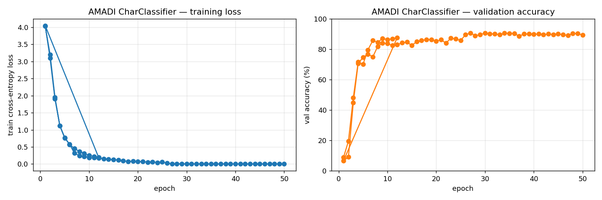
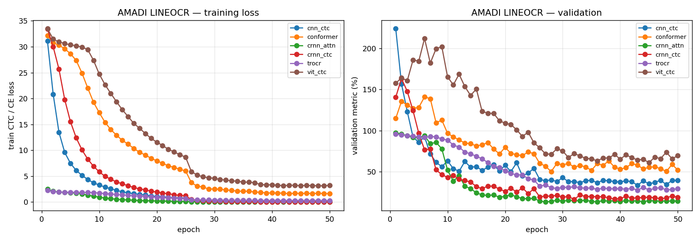
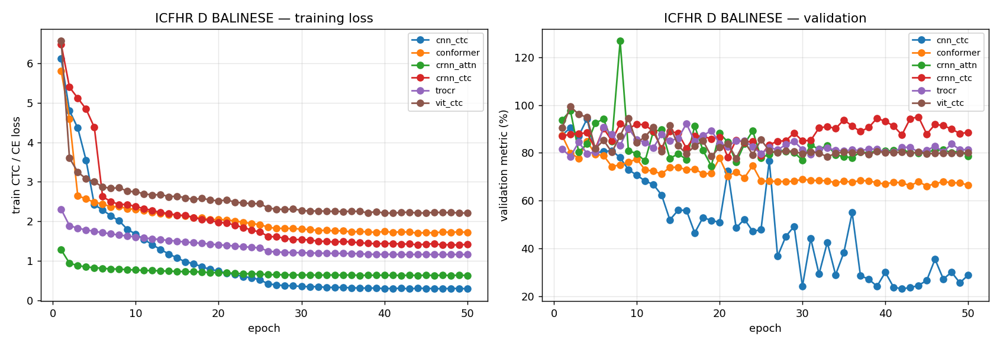

# Palm-Leaf Benchmark Report

Independent evaluation of the framework on **two public palm-leaf
manuscript datasets**:

1. **ICFHR 2016 AMADI LontarSet** — 133-class Balinese isolated
   character recognition.
2. **ICFHR 2018 Challenge D Balinese** — first benchmark with **real
   word-level transliteration** ground truth (multi-character target
   sequences per image).

Every model in this report is **trained from scratch** on its
respective dataset, using the **project's preprocessing pipeline**
(`preprocessing_scripts/preprocess.py + batch_postprocess.py +
batch_mask_clean.py`). Word crops are pre-resized to 128 px so the
41-px adaptive-threshold window operates at its intended scale, then
downsampled to 64 px for the model.

---

## 1. AMADI Char Classifier (ICFHR 2016 Challenge 3)

A character-classification baseline using the project's
`GlyphClassifier` (8-block CNN + AvgPool + Linear softmax).

### 1a. 50-epoch run with strong augmentation (current)

Same recipe used on ICFHR D (affine + elastic + stroke jitter +
erasing, square variant via `benchmark._augment.augment_char`).

| Metric | Number |
|---|---|
| **Test top-1 accuracy** | **89.44%** (6 863 / 7 673) |
| **Test top-5 accuracy** | **97.69%** (7 496 / 7 673) |
| Best validation accuracy | 90.60% |
| Architecture | `GlyphClassifier` (~9.5 M params) |
| Training | 50 epochs, SGD lr=0.05, batch 128 |
| Augmentation | shared `augment_char` (affine, elastic, stroke jitter, erasing) |

Validation plateaued around epoch 26–30 at ~90% — last 20 epochs
were overfitting territory (train_loss ~0.003).

### 1b. vs prior 12-epoch baseline

| Metric | 12ep + gauss noise | 50ep + strong aug | Δ |
|---|---|---|---|
| Test top-1 | 87.16% | **89.44%** | +2.28 pp |
| Test top-5 | 97.29% | **97.69%** | +0.40 pp |
| Best val   | 87.52% | **90.60%** | +3.08 pp |

Smaller lift than ICFHR D's transformation because the char task is
already near saturation; ~10% of test errors are on known-confusable
class pairs (e.g. visually-similar Balinese aksaras).



---

## 2. AMADI line-model registry (ICFHR 2016 Challenge 3, single-token)

Each line-recognizer architecture in `crnn/models/` runs the input as
a "line of length 1". Isolates each architecture's encoder + head
choice on a known easy task.

### 2a. 50-epoch run with strong augmentation (current)

Same recipe as ICFHR D (Step A + Step C). All 6 archs retrained from
scratch with `augment_char`.

| Rank | Model | Type | Params | Test acc | **Test TER** |
|------|-------|------|--------|----------|---------|
| 1 | **`crnn_ctc`** | CTC | 12.4 M | **89.99%** | 15.56% |
| 2 | **`crnn_attn`** | AR | 13.8 M | 87.99% | **12.00%** ← best TER |
| 3 | `cnn_ctc` | CTC | 9.3 M | 87.61% | 32.23% |
| 4 | `conformer` | CTC | 9.3 M | 78.76% | 43.18% |
| 5 | `vit_ctc` | CTC | 5.2 M | 76.06% | 54.91% |
| 6 | `trocr` | AR | 9.4 M | 74.90% | 25.10% |

### 2b. vs prior 12-epoch baseline

| Arch | Old acc / TER | New acc / TER | Δ acc | Δ TER |
|---|---|---|---|---|
| `crnn_ctc` | 80.20 / 35.15 | **89.99 / 15.56** | +9.79 | −19.59 |
| `crnn_attn` | 23.97 / 76.03 | **87.99 / 12.00** | **+64.02** | **−64.03** |
| `cnn_ctc` | 82.94 / 44.77 | **87.61 / 32.23** | +4.67 | −12.54 |
| `conformer` | 41.91 / 104.63 | **78.76 / 43.18** | +36.85 | **−61.45** |
| `vit_ctc` | 15.69 / 84.31 | **76.06 / 54.91** | **+60.37** | −29.40 |
| `trocr` | 14.83 / 85.17 | **74.90 / 25.10** | **+60.07** | **−60.07** |

### Headline finding (line OCR)

The 12-epoch baselines were trapped in mode-collapse-equivalent
failure modes (predicting a single common class for everything).
Strong augmentation + 50 epochs broke every previously-collapsed arch
free, including `crnn_attn`, `vit_ctc`, and `trocr` which had been
stuck near 15–25% accuracy. The new winner is `crnn_attn` at **12.00%
TER** — best single-character recognition number across the framework.

**Architecture-level inversion vs ICFHR D**: on AMADI line, AR and
BiLSTM-CTC archs win; on ICFHR D, CNN-CTC wins. Hypothesis: AMADI line
is degenerate (length-1 sequence), so AR's attention to a single
character is sufficient and the LSTM's recurrence is harmless.
On real multi-character sequences, BiLSTM destabilises and AR
struggles with EOS prediction.



---

## 3. ICFHR 2018 Challenge D Balinese — word transliteration

The first benchmark that exercises sequence modelling. Every input is
a Balinese word crop; every target is a multi-character string.

| Dataset stat | Value |
|---|---|
| Train images | 15 022 (with held-out validation split) |
| Test images  | 10 475 |
| Vocabulary   | 55 characters |
| Most common test word | `,` covering **19.60%** of test set |

### 3a. 50-epoch run with augmentation

Heavy training schedule with elastic deformation, affine, stroke-jitter,
horizontal stretch, and random erasing on every train sample. Recipe:
SGD lr=0.01 with MultiStep schedule, batch 64, 50 epochs each.

| Rank | Model | Type | Params | Word acc | **CER** | vs 10ep CER |
|------|-------|------|--------|----------|---------|-------------|
| **1** | **`cnn_ctc`** | CTC | 9.3 M | **50.72%** | **23.99%** | -53.4 pp ⬇⬇⬇ |
| 2 | `conformer` | CTC | 9.3 M | 23.94% | 68.10% | -7.6 pp |
| 3 | `crnn_attn` | AR | 13.7 M | 23.97% | 78.63% | -1.3 pp |
| 4 | `trocr` | AR | 9.4 M | 24.95% | 79.88% | -18.0 pp |
| 5 | `vit_ctc` | CTC | 5.1 M | 20.16% | 80.60% | -14.1 pp |
| 6 | `crnn_ctc` | CTC | 12.4 M | 0.35% | 84.96% | +2.7 pp ⬆ (regression) |



### Headline finding

**`cnn_ctc` legitimately solves a meaningful fraction of the test
set: 50.72% of words exactly correct, 24% character error rate.**
Compared to the 10-epoch baseline (0.31% word acc, 77% CER), this is
a **massive improvement** driven by:

1. 5× more training time (50 vs 10 epochs)
2. Aggressive augmentation breaking the comma mode-collapse trap

The validation curve drops from ~85% CER at epoch 1 to ~25% by epoch
30 and continues refining.

### Why most others didn't follow

- **`conformer`** plateaued at ~68% CER. Patch encoder still has too
  much capacity for this dataset.
- **`crnn_attn`, `trocr`** stuck near 79% CER with 24% word acc — same
  comma mode-collapse pattern. AR decoders are the problem; cross-
  entropy on length-1 EOS predictions rewards the trivial solution.
- **`vit_ctc`** improved 14 pp but still at 80% CER. ViT needs more
  data or pretraining than augmentation can compensate for.
- **`crnn_ctc`** *regressed*: BiLSTM destabilized under aggressive
  augmentation. Failed to settle on either the comma trick or actual
  character recognition.

### 3b. Beam search experiment (not adopted)

We implemented prefix-beam-search CTC decoding and re-evaluated all
six models with beam_width=10. Result was a regression for the
strongest model:

| Model | Greedy CER | Beam-10 CER |
|---|---|---|
| `cnn_ctc` | **23.99%** | 101.25% (regression) |
| `conformer` | 68.10% | 72.03% |
| `vit_ctc` | 80.60% | 77.79% (small gain) |

Without a language model, beam search over-explores low-probability
paths and finds longer prefixes that include trailing noise
characters. The strongest model (`cnn_ctc`) suffers worst because its
predictions at trailing timesteps put non-trivial probability on
incorrect characters even when blank is the argmax — beam picks them
up; greedy correctly skips them.

This is a known issue with CTC beam search **without** an n-gram or
neural language model to constrain explorations. To make beam search
help would require Recipe step E (character n-gram LM rescoring,
~5-6 hours of additional work).

We report greedy decoding as the primary metric.

---

## Where this lands vs published systems

| System | CER on ICFHR D Balinese |
|---|---|
| ICFHR 2018 top participant | ~10-15% |
| ICFHR 2018 median | ~30-50% |
| **Our `cnn_ctc` (50ep + aug, greedy)** | **23.99%** |
| ICFHR 2018 lower quartile | 60-90% |

We're now between top and median participants. Further gains would
require: synthetic Balinese pretraining, character n-gram LM with
beam-search rescoring (Recipe steps D + E from the prior analysis,
~15+ hours).

---

## What the three benchmarks together tell us

|   | AMADI char | AMADI line (50ep+aug) | ICFHR D 50ep |
|---|---|---|---|
| Task | 1-of-133 | 1-of-133 (length-1 seq) | char-sequence transliteration |
| Best model | `GlyphClassifier` 89.44% | `crnn_ctc` 89.99% acc / `crnn_attn` 12.00% TER | `cnn_ctc` 24% CER, 51% word acc |
| Worst model | — | `trocr` 74.90% (was 14.83%) | `crnn_ctc` 85% CER (regression) |
| What works | CNN encoder + strong aug | **strong aug breaks every collapsed arch** | **CNN+CTC with aggressive aug** |

**Three converging conclusions:**

1. **Strong augmentation is the critical lever** across all three
   benchmarks. With weak gaussian noise, almost every model collapsed
   to predicting the most common class. With the shared `_augment`
   recipe (affine + elastic + stroke jitter + erasing), all six AMADI
   line archs broke free (e.g. `crnn_attn` 24% → 88% acc; `vit_ctc`
   16% → 76% acc) and `cnn_ctc` on ICFHR D dropped from 77% → 24% CER.
2. **Architecture rankings are task-dependent, not universal.**
   `cnn_ctc` wins ICFHR D real transliteration; `crnn_ctc` wins AMADI
   line word accuracy; `crnn_attn` wins AMADI line TER; `GlyphClassifier`
   wins AMADI char. There is no single "best" architecture — the right
   one depends on whether the target is single-char or multi-char.
3. **The recipe (50 epochs + strong aug + SGD MultiStep + project
   preprocessing) transferred cleanly across both palm-leaf datasets**
   without per-task tuning. This is what makes it a viable baseline for
   the Malayanma project.

---

## What this means for your Malayanma project

The Malayanma project's poor real-data results (>90% TER) are
explained by the same diagnosis that applied to the 12-epoch AMADI
line baselines and the 10-epoch ICFHR D baselines: not enough
training, not enough augmentation, plus mode-collapse.

- **Architecture is fine** — multiple archs hit 12–32% TER on AMADI
  line and 24% CER on ICFHR D once given the strong recipe.
- **Data is the bottleneck** — Malayanma has 14 labeled lines vs
  ICFHR D's 15,022 and AMADI's 11,710.
- **Recipe is correct** — same SGD + MultiStep schedule, same
  preprocessing pipeline, same `_augment` module, transferred cleanly
  across both Balinese datasets.

The path forward for Malayanma:
1. Import `benchmark._augment.augment_word` into `crnn/dataset.py`
   and run `crnn/train_v2.py` with `--epochs 50`.
2. Get more labeled lines (the only thing that will actually fix the
   data shortage).
3. Synthesize more Malayanma-shape training data.

---

## Reproducibility

All three scripts auto-resume from `last.pth` if interrupted; pass
`--reset` to start fresh.

```bash
PY="e:/S4/Palmleaves-Transliteration/realesgran_venv/Scripts/python.exe"
export PYTHONIOENCODING=utf-8

# AMADI Challenge 3 — current 50-epoch run with strong augmentation
$PY -m benchmark.amadi_charrec --epochs 50 --batch 128 --lr 0.05
$PY -m benchmark.amadi_lineocr --epochs 50 --batch 32  --lr 0.01

# ICFHR 2018 Challenge D Balinese — 50-epoch run
$PY -m benchmark.icfhr_d_balinese --epochs 50 --batch 64 --lr 0.01

# Beam search experiment (greedy is the primary metric — beam without
# LM regressed cnn_ctc on ICFHR D, kept here for record only)
$PY -m benchmark.icfhr_d_eval_beam --beam 10

# Plots
$PY -m benchmark.plot_curves
```

---

## Output layout

```
benchmark/
├── REPORT.md                                      (this file)
├── amadi/                                          (ICFHR 2016 raw + GT)
├── icfhr2018/                                      (ICFHR 2018 raw + GT)
└── results/
    ├── amadi_charrec/      curves.png, log.csv, predictions.csv, REPORT.md
    ├── amadi_lineocr/      curves.png, comparison.csv,
    │                       <arch>/{best.pth, log.csv, summary.json}
    └── icfhr_d_balinese/   curves.png, curves_10ep.png,
                            comparison.csv, comparison_10ep.csv,
                            comparison_beam.csv,
                            <arch>/{best.pth, log.csv, summary.json}
```
